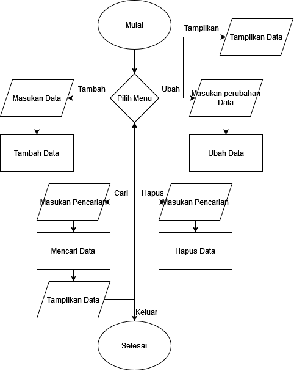

# <p align="center"> TUGAS PEMROGRAMAN Pertemuan 11 - Latihan.py & TugasPraktikum.py
[](https://www.linkedin.com/in/melvian-wijaya-760b371b1/)


<br>


# [Latihan.py]

<p align="justify">Merubah Funtion native dengan Lambda.

- Menggunakan Lambda.
```sh
lambdaB = lambda b, y: math.sqrt(b ** 2 + y ** 2);
```
----

# Hasil Output Latihan.py

----

<br>

<br>

<br>

# [TugasPraktikum.py](https://github.com/melviandanuw/TugasKelilingLuasLingkaran/blob/main/tugas.py)

<p align="justify">Program Data sederhana menggunakan Function, List & Dictionary dengan menu Tambah, Ubah, Tampilkan, Hapus, dan Cari.

- Import Libary Tabulate untuk membuat table.
```sh
from tabulate import tabulate;
```
- Membuat Dictionary.
```sh
dataMahasiswa = {}
```
- Menggunakan perulangan While, selama masih true maka program akan tetap berjalan.
```sh
while (True):
```
- Menggunakan If Else untuk menentukan menu.
```sh
if inputs == 't':
```
- Menyimpan function tambah dan memprosesnya.
```sh
def tambah():
        nama = str(input("Masukan Nama : "))
        nim = int(input("Masukan Nim   : "))
        tugas = int(input("Masukan Nilai Tugas : "))
        uts = int(input("Masukan Nilai UTS     : "))
        uas = int(input("Masukan Nilai UAS     : "))
        akhir = (tugas / 3) + (uts / 3.5) + (uas / 3.5)
        dataMahasiswa[nama] = nim, tugas, uts, uas, akhir,
        print("\nDATA BERHASIL DI TAMBAHKAN!")
```
----

# Hasil Output TugasPraktikum.py


# Flowchart


